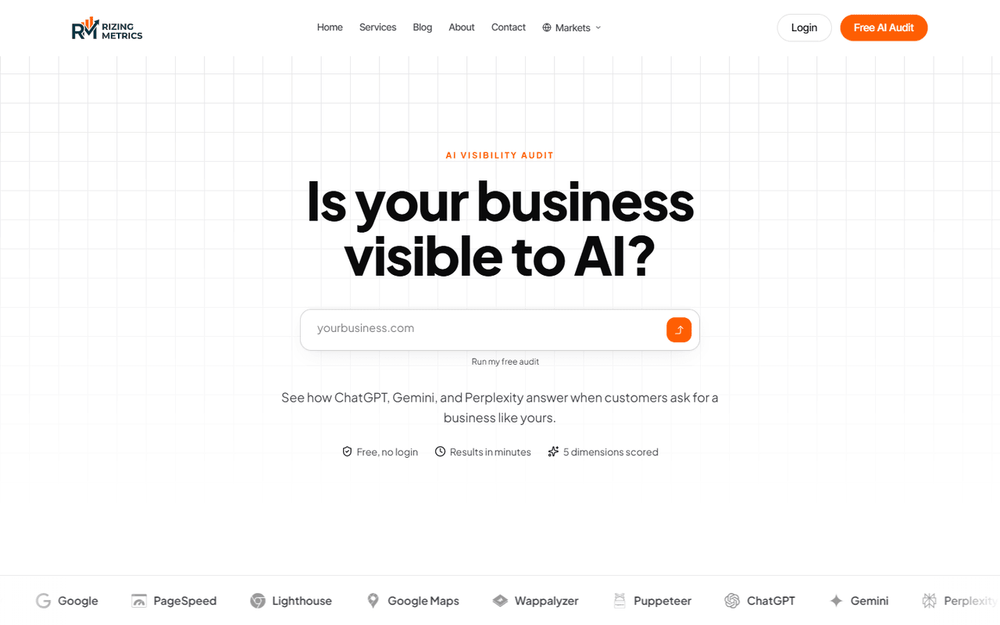
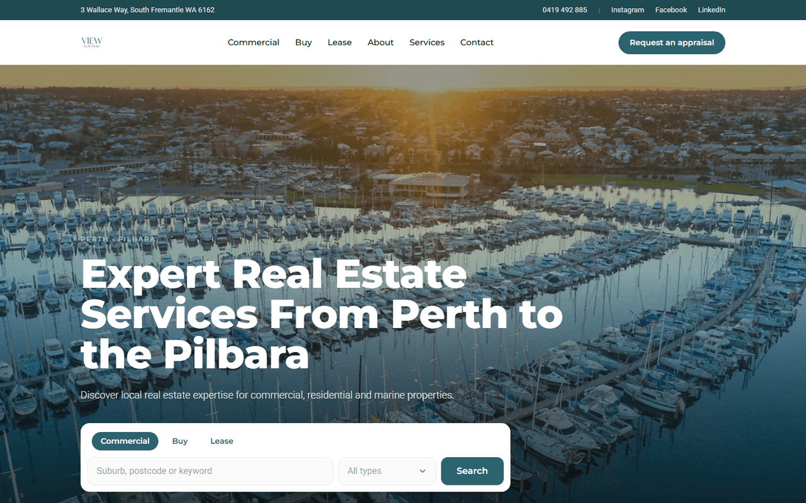
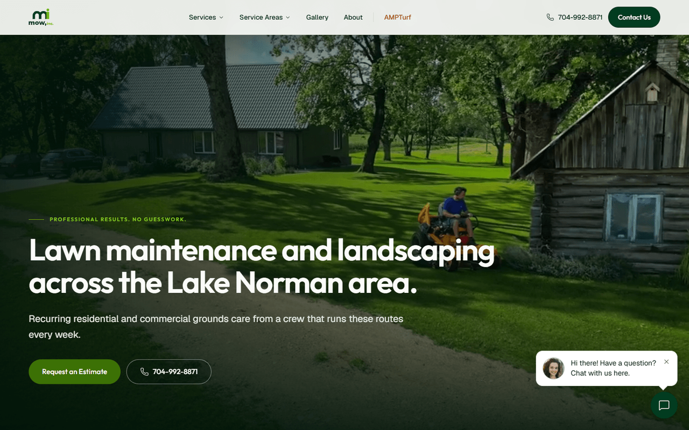
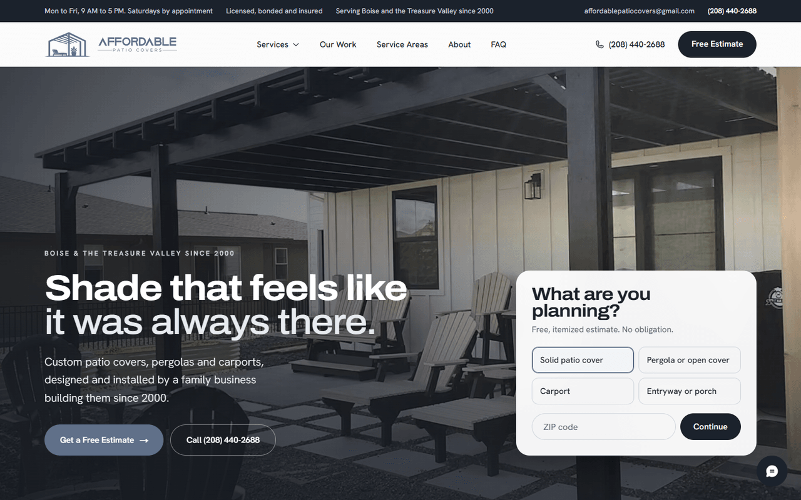
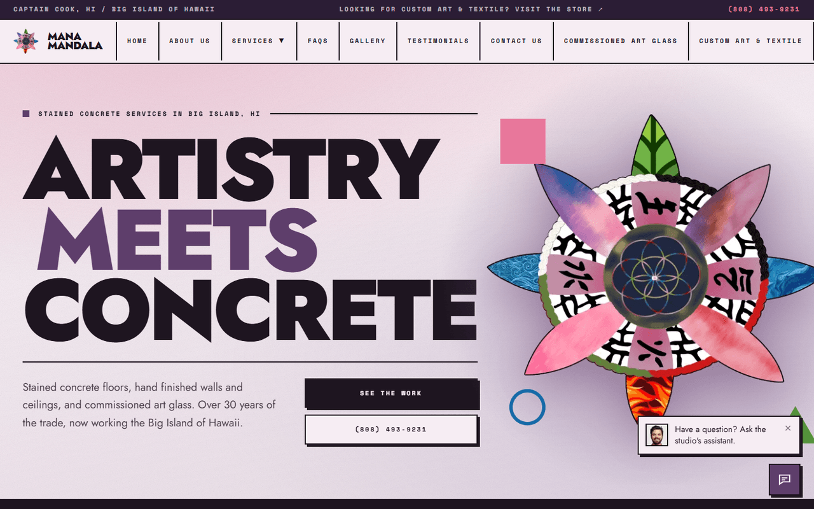
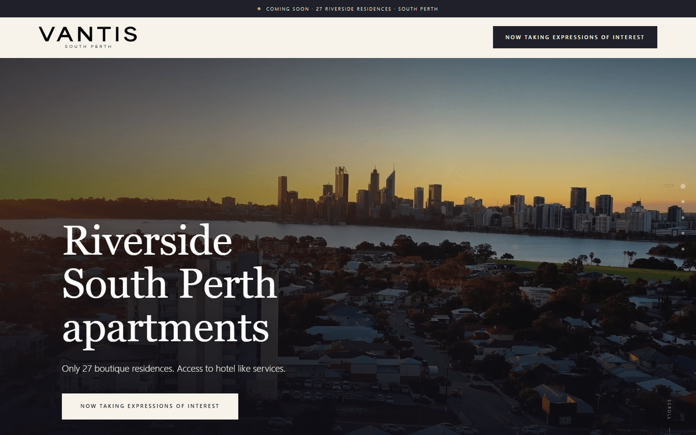

# Case studies

Production work by [Talha Muneer](https://github.com/talha55) for agencies, small businesses and large international firms, with clients in the United States, Australia, the United Kingdom and across Europe. Each study covers the problem, what was built, the architecture, and measured results. No source code is included. Client code stays private.

| | Project | Type | Stack |
|---|---|---|---|
|  | [Rizing Growth OS](rizing-growth-os.md) | AI audit SaaS | Next.js, NestJS, Postgres, BullMQ |
|  | [View Real Estate](view-real-estate.md) | Agency site with CRM-fed listings | Laravel, REAXML, MariaDB |
|  | [ATLANTA INK®](atlanta-ink.md) | Studio site with booking and chat | Next.js, MDX, Vercel |
|  | [Mow, Inc. and AMPTurf](mow-ampturf.md) | Two local service sites, one per brand | Next.js, structured data, Vercel |
|  | [Affordable Patio Covers](affordable-patio-covers.md) | Local service site with estimate requests | Next.js, GSAP, Vercel |
|  | [Mana Mandala Studio](mana-mandala-studio.md) | Contractor portfolio site | Next.js, GSAP, Google Places |
|  | [Rizing Metrics marketing site](rizing-metrics-site.md) | Agency site with services, blog and pricing | Next.js, structured data, Vercel |
|  | [AI SEO For Me](ai-seo-for-me.md) | Immersive WebGL marketing site | Next.js, Three.js, GSAP |
|  | [Vantis Apartments](vantis-apartments.md) | Pre-launch property campaign site | Next.js, MapLibre, Tag Manager |
| | [WordPress malware cleanup](wordpress-malware-cleanup.md) | Security incident response, anonymised | WordPress, PHP, MySQL |

Shorter entries for eleven more sites on Webflow, Shopify and WordPress are in [More client work](more-client-work.md).

Screenshots are of publicly accessible pages and remain the property of the respective businesses. See [LICENSE](LICENSE) for how the written content may be used and [ATTRIBUTION.md](ATTRIBUTION.md) for which clients have agreed to be named.
