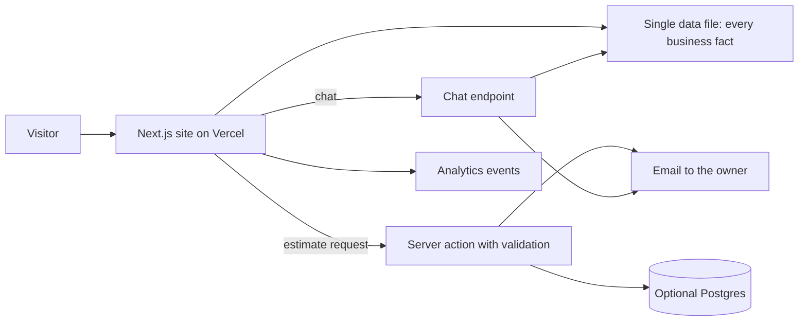

# Affordable Patio Covers

## At a glance

| | |
|---|---|
| Industry | Patio cover, pergola and carport builder, Boise and the Treasure Valley, Idaho |
| Type | Local service business site with estimate requests and a chat assistant |
| Stack | Next.js 16, TypeScript, Tailwind, GSAP, Motion, Lenis, transactional email API, optional Postgres, LLM-backed chat, GA4 and Tag Manager events, Vercel |
| Live | https://www.affordablepatioscover.com |
| Year | 2026 |
| Role | Solo build: design, front end, content migration, SEO, deployment |

## The problem

Affordable Patio Covers is a family business that has been building patio covers around Boise since 2000. Their old site was dated and did little to turn a visitor into an estimate request. The owner wanted something that looked considered and did not read like a template, and it had to stay truthful: a contractor's licence status, opening days and customer reviews are facts, and a redesign is an easy place for them to get rounded off or embellished.

## What I built

- A site with a page for each product (solid covers, pergolas and open covers, carports, entryways and porches, privacy walls, repairs), a page for each town served, a gallery of the company's own work, About, FAQ and Contact.
- An estimate request that starts in the hero: pick what you are planning, enter a ZIP code, continue. It is handled on the server with validation and delivered to the owner by email, with an optional database record.
- A chat assistant for visitors who would rather ask than fill in a form. It is labelled as a virtual assistant in its header, never claims to be a person, and can only state facts that exist in the site's own data file.
- A sourcing pass over every claim. Each fact on the site traces back to the old site or the company's Google profile. Review quotes match their source character for character, and photos that could not be confirmed as the company's own work were held back.
- A second design round after feedback that the first draft looked like every other website. The stock section sequence was thrown out, the display typeface changed, and a horizontal slider was replaced with a photo wall.
- A responsive pass with layout breakpoints chosen for tablets and small laptops as well as phones and desktops, verified at fifteen widths.
- Conversion events wired through Tag Manager.

## Architecture

## Results

- The business moved from a dated site to one built around its own photography and its own logo, with an estimate request reachable from the first screen.
- Every statement on the site has a source. The licence, the opening days and the review wording were carried across exactly, and unsourced claims found in review were removed.
- Feedback on the first design changed the build, and the second round is what shipped.

## What the client got

- A worklog that records every decision, every audit finding and the reason behind each ruling, so the next person can see why the site says what it says.
- A sources folder holding the original site text and the reviews, for future fact-checking.
- A launch checklist covering environment variables, email domain verification, analytics and the indexing switch.
- A logo pipeline that derives the header lockup and all icons from the client's original artwork with one script.
