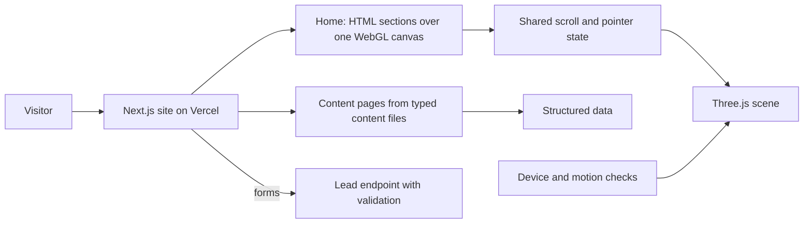

# AI SEO For Me

## At a glance

| | |
|---|---|
| Industry | AI SEO packages for local businesses, United States |
| Type | Immersive WebGL marketing site with search-focused content pages |
| Stack | Next.js, React, TypeScript, Tailwind, Three.js, GSAP ScrollTrigger, Lenis, Motion, structured data, Vercel |
| Live | https://www.aiseoforme.com |
| Year | 2026 |
| Role | Solo build: design, WebGL, front end, deployment |

## The problem

AI SEO For Me sells a new idea to local business owners: customers now ask an AI assistant who to hire, and the answer names only two or three businesses. The site has to make that land in a few seconds for someone who has never heard the term, which calls for something more memorable than a standard landing page. It also has to rank, and a page that is mostly a 3D canvas gives a search engine very little to read.

## What I built

- An immersive home page on a single shared WebGL canvas: a particle field that assembles into the brand mark, a five-step scroll story explaining how AI answers work, and a mock AI answer box that shows a business being cited.
- A two-layer structure. The cinematic layer carries the story, and ordinary HTML sections carry the copy, so everything a visitor or a crawler needs is real text in the document.
- A set of content pages (each service, pricing, the visibility checker, About, Contact) rendered from typed content files through one page template, added after the immersive home so the site could compete on search as well as on first impression.
- Structured data generated from the same content files and covered by tests, so a copy change cannot leave the schema out of date.
- A visibility checker entry form and a contact form backed by a server-side lead endpoint with validation.
- Graceful degradation at every level: fewer particles and native scrolling on phones and low-power devices, no motion at all under reduced-motion settings, and a flat-colour fallback when WebGL is unavailable.
- Illustrative content, such as the sample questions and business names in the answer demo, visibly labelled as examples on the page.

## Architecture

## Results

- The idea the business sells is shown, not just described: the visitor watches an AI answer cite a business before reading a word of sales copy.
- The site works as a search asset as well as a showpiece, with a full set of crawlable service pages alongside the immersive home.
- The experience holds up on a phone and with motion turned off, because the content never depended on the canvas.

## What the client got

- A content layer separated from the components: copy, pricing and page structure are edited in typed files without touching the 3D code.
- Scripts that check SEO metadata, deep links and hydration on every page before a release.
- A design spec and a README describing how the canvas, scroll state and fallbacks fit together.
