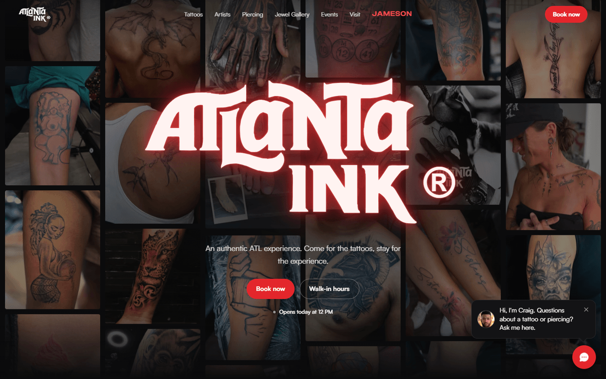
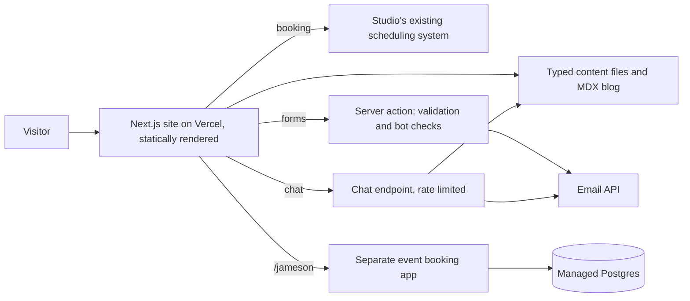

# ATLANTA INK®

## At a glance

| | |
|---|---|
| Industry | Tattoo, piercing and jewellery studio, Grant Park, Atlanta |
| Type | Studio website with artist portfolios, booking requests and a chat assistant |
| Stack | Next.js 16, TypeScript, Tailwind, Motion, GSAP, Lenis, MDX, Cloudflare Turnstile, transactional email API, LLM-backed chat, Vercel |
| Live | https://www.atlantaink.com |
| Year | 2026 |
| Role | Solo build, delivered through an agency |

## The problem

ATLANTA INK® had a template site on a hosted website builder that looked like every other studio's and gave the artists' work very little room. The studio wanted a site with the feel of the shop at night, one that sends people to the right artist and gets them booked. Two things could not be lost in the move: the search visibility of the existing artist and blog URLs, and the studio's existing appointment system, which the artists already run their calendars in.

## What I built

- A dark, photography-led site covering tattoos, piercing, the Jewel Gallery, events, merch, guest artists and FAQs, with a home page built around the studio's own work and film rather than stock imagery.
- A portfolio page for each artist, kept on the same URL it had on the old site, with the galleries migrated and image dimensions recorded so pages do not jump as photos load.
- A booking flow that asks what the visitor wants, routes them to the right artist's calendar in the studio's existing scheduling system, and offers a consultation request with reference and placement photos for larger pieces. Photos are resized in the browser before upload.
- One server-side form handler for every form on the site, with schema validation, a honeypot, bot protection and rate limiting, sending branded notification and confirmation emails.
- A chat assistant that answers from the same content files the pages render, so it stays current with the site, and that hands a lead to the studio when a visitor wants a call back. It is rate limited and has written rules about what it may not promise.
- The existing blog migrated to MDX with its original slugs, plus redirects for every other legacy URL.
- A separate event booking app (voucher redemption, artist and time-slot selection, an admin calendar) that runs as its own deployment and is mounted under the main domain.

## Architecture

## Results

- The studio moved off the website builder without changing an artist or blog URL, so existing links and search listings carried over.
- Booking stayed in the system the artists already use. The site's job is to get the visitor to the right calendar, and it does not duplicate one.
- Missing client content ships as nothing, never as filler. No reviews, artist credits or statistics on the site were invented.

## What the client got

- A site with no CMS to patch or license: content lives in typed files, and the handover document says which file to change for which page.
- A launch checklist, an environment variable reference and a set of re-runnable import scripts for galleries, blog posts and merch.
- An automated smoke run that visits every route at phone and desktop widths, plus accessibility, keyboard and reduced-motion checks.
- A test suite covering content rules, form schemas, redirects and SEO metadata.
