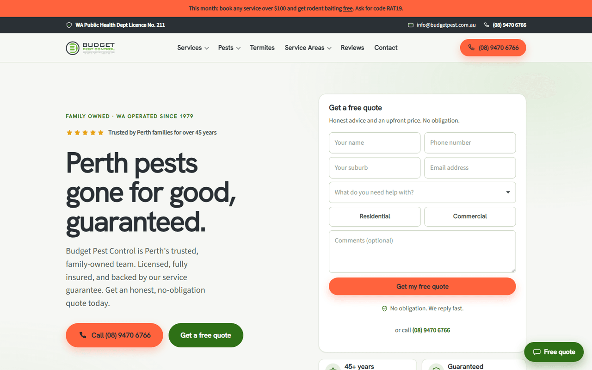
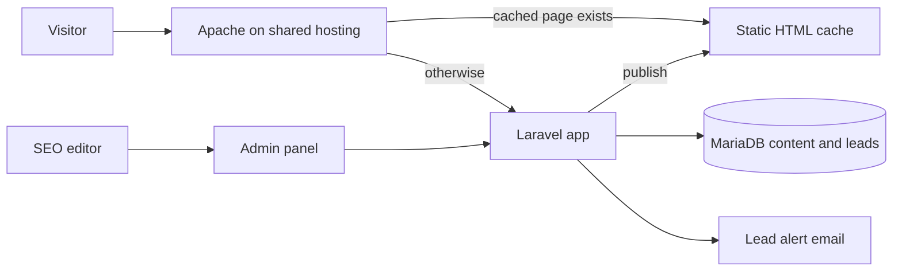

# Budget Pest Control

## At a glance

| | |
|---|---|
| Industry | Pest control, Perth, family-owned since 1979 |
| Type | Service business marketing site with an editable CMS |
| Stack | Laravel 12, PHP 8, Blade, MariaDB, static page cache, shared hosting (cPanel) |
| Live | https://www.budgetpest.com.au |
| Year | 2026 |
| Role | Solo build, delivered through an agency |

## The problem

Budget Pest Control had a 97-page site that ranks well and brings in most of their enquiries. The agency wanted to rebuild it so their SEO team could edit titles, descriptions and page content themselves, without risking the rankings. Two hard constraints: the public HTML of every page had to stay effectively identical through the rebuild, and it had to run on ordinary shared hosting with no Node runtime and no build server.

## What I built

- A Laravel rebuild of all 97 pages with content stored in the database and rendered through Blade templates.
- A parity test suite. Every page's rendered HTML is diffed against a frozen copy of the original, so a template change can never silently alter the markup that search engines see. Deliberate improvements are registered explicitly, one by one.
- A static page cache. Once a page is rendered its HTML is written to disk and served by Apache directly, without starting PHP at all. Publishing a change regenerates just that page and the sitemap.
- An admin panel where the SEO team edits metadata and content, previews, and publishes. Changes go live in seconds.
- Lead capture for quote and contact forms with a queued alert email, 301 redirects managed from the admin, and a quote widget on every page.
- A self-contained deploy package with a web installer, so the agency can install or update the site on cPanel by uploading a single archive. No Composer, no SSH required.

## Architecture

## Results

- All 97 pages rebuilt with their public markup preserved, verified by an automated suite of over 700 tests that runs green on every change.
- The SEO team edits and publishes without a developer. A published change is live in seconds because only that page's cache is regenerated.
- Cached pages are served by Apache without starting PHP, which keeps the site fast on shared hosting under traffic spikes.

## What the client got

- A site their own team edits, with publishing that regenerates the cache and sitemap automatically.
- A developer handover document covering the architecture, the page cache model, deployment and the known traps, written for someone who has never seen the code.
- A one-archive deploy process that works on their existing shared hosting.
