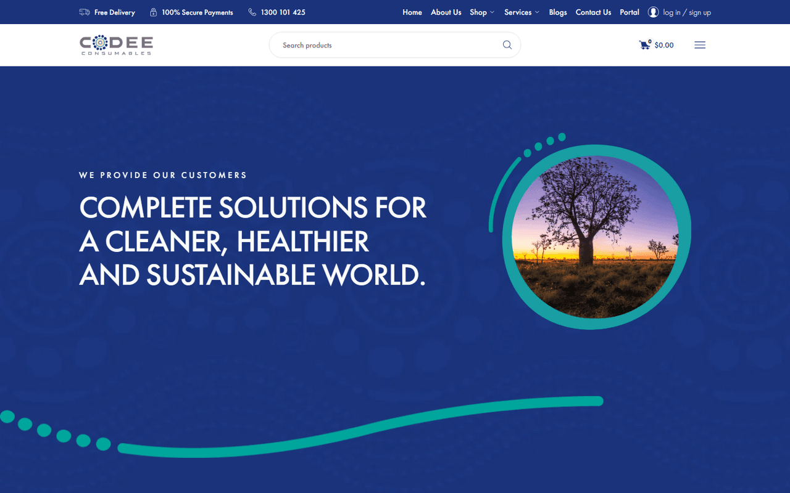
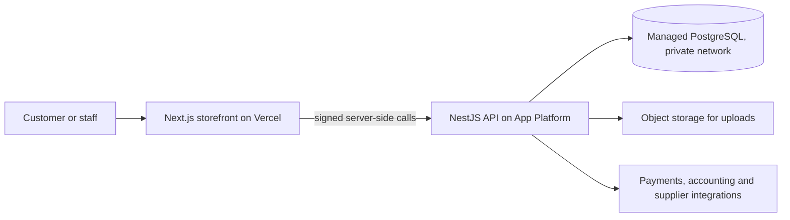

# Codee Consumables

## At a glance

| | |
|---|---|
| Industry | Cleaning and hygiene consumables supplier, Australia |
| Type | B2B and retail ordering platform with role-based accounts |
| Stack | Next.js, NestJS, Prisma, PostgreSQL, DigitalOcean App Platform, Managed Postgres, Spaces object storage, Vercel, Cloudflare Turnstile |
| Live | https://codeeconsumables.com.au |
| Year | 2026 |
| Role | Solo build: back end, front end, data migration, deployment |

## The problem

Codee Consumables was selling through an ageing WooCommerce store that did not fit how their business customers actually order. Companies need multiple staff placing orders under one account, managers approving them, and account-specific pricing, none of which the old store handled. They needed a platform they own, with their existing customers and order history carried across, and with hosting that someone can maintain after the project ends.

## What I built

- A storefront with product search, categories, cart and checkout, built in Next.js and rendered server-side for speed and search visibility.
- Role-based accounts: company, manager, staff, customer and pending-approval, so a business can onboard its team and control who orders what.
- A separate NestJS API that owns the data, authentication and business rules, so the storefront can be changed or replaced without touching the core.
- Migration of the existing customers, orders and product catalogue from the old store into the new database, with the legacy product images continuing to serve during the transition.
- Admin tooling for products, orders, accounts and settings, with integrations for payments, accounting and supplier sync configured from the admin screen rather than from code.
- Bot protection on sign-up and forms, PDF and spreadsheet exports for orders, and uploads stored in object storage so nothing lives on a server disk.
- A split deployment: front end on Vercel, API on DigitalOcean App Platform with a managed database on a private network, so each piece scales and deploys on its own.

## Architecture

## Results

- Business customers can now order the way they work: several staff under one company account, with approval in the loop.
- Existing customers and order history carried across, so nobody had to re-register and reporting stayed continuous.
- Product pages render server-side and score well on mobile performance in Lighthouse, with zero layout shift on the home page.

## What the client got

- A platform they own outright: code in their GitHub, hosting in their own cloud accounts, no per-seat licence.
- Automatic deploys on push for both halves, with health checks and zero-downtime rollouts on the API.
- A deployment runbook listing every environment variable and where it lives.
- A test harness with seeded QA users for each role, so changes can be checked before they reach customers.
