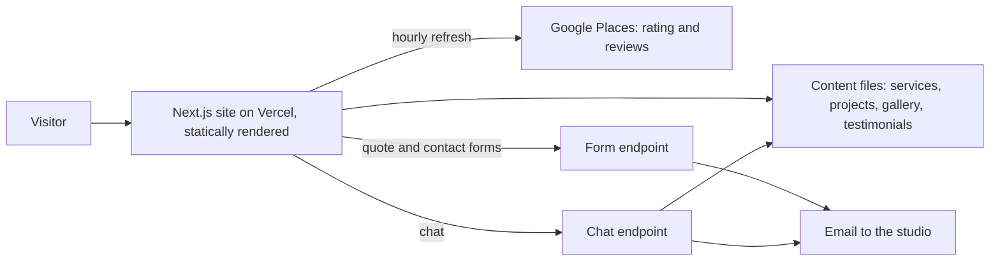

# Mana Mandala Studio

## At a glance

| | |
|---|---|
| Industry | Decorative concrete and finishing contractor, Big Island, Hawaii |
| Type | Contractor portfolio site with quote requests, live reviews and a chat assistant |
| Stack | Next.js 16, React 19, TypeScript, Tailwind, GSAP ScrollTrigger, Motion, Lenis, Google Places API, transactional email API, LLM-backed chat, Vercel |
| Live | https://www.manamandalastudiohi.com |
| Year | 2026 |
| Role | Solo build: design, front end, content migration, deployment |

## The problem

The name suggests a yoga studio. Mana Mandala Studio is a decorative finishing contractor: stained concrete floors, hand-finished walls and ceilings, basalt restoration and commissioned art glass, with over thirty years in the trade. The old WordPress site buried that under generic service copy and a logo image that no longer loaded. The studio needed a site that makes it obvious within a second what the work is, shows a lot of it, and keeps the old site's search standing.

## What I built

- A design system taken from the studio's own painted logo. Every colour was sampled from the artwork, set on a hard Bauhaus-style grid with oversized geometric type, flat colour planes and square corners, so the site looks like nobody else's and the headline says concrete.
- A scroll-driven hero built on the real logo artwork. An earlier vector reconstruction was rejected in favour of the original painting.
- A gallery of more than two hundred of the studio's own photographs, imported by a re-runnable script, with captions kept general wherever the subject could not be confirmed.
- Service pages rewritten around real material facts and named projects in place of the old boilerplate.
- The studio's published testimonials, extracted from the old site's markup one card at a time. A top-down read of the rendered page pairs each review with the wrong name, so attribution was verified against the source.
- Google rating and reviews fetched live from Google and refreshed hourly, labelled separately from the website testimonials so one is never presented as the other.
- Contact and quote forms and a chat assistant, each emailing the studio with the visitor in the reply-to field.
- Redirects for every legitimate old URL, and a sitemap that lists only real pages.

## Architecture

## Results

- A visitor can tell what the business does from the first screen, which the name alone and the old site did not manage.
- The studio's work is shown in its own colours. A colour-tint effect that looked striking in design was removed because it made the finishes read as posters and not as the real surface.
- Every photograph on the site is the studio's own. No stock or borrowed images stand in for its work.
- Motion collapses to a complete static page under reduced-motion settings or if scripts fail.

## What the client got

- A handover README covering the design system, where each piece of content lives and how to add work to the gallery.
- A written list of honest gaps for the studio to fill, such as wording that still needs the owner's confirmation.
- A site with no CMS, plugins or database to maintain: pages are static, and only the forms and chat run on the server.
