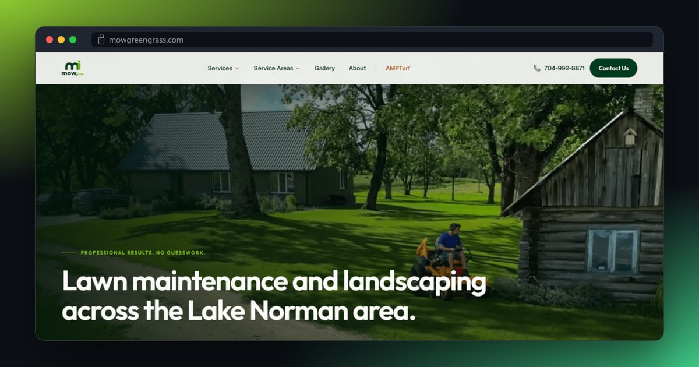
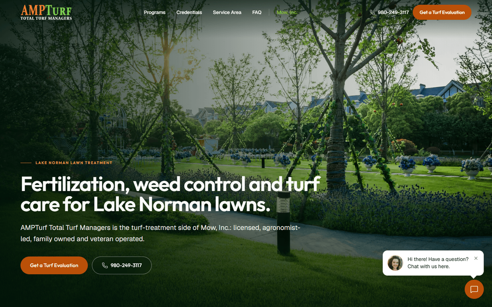
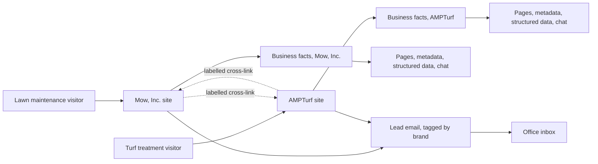

# Mow, Inc. and AMPTurf

## At a glance

| | |
|---|---|
| Industry | Lawn maintenance and landscaping (Mow, Inc.) and turf treatment (AMPTurf), Lake Norman area, North Carolina |
| Type | Two local service business sites on two domains, one per brand |
| Stack | Next.js 16, TypeScript, Tailwind, GSAP, Lenis, structured data, transactional email API, LLM-backed chat, Vercel |
| Live | https://www.mowgreengrass.com and https://www.ampturf.com |
| Year | 2026 |
| Role | Solo build: design, front end, content, SEO, deployment |

## The problem

Mow, Inc. maintains lawns and landscapes around Lake Norman. AMPTurf is its turf-treatment division, with its own name, its own phone number and its own Google Business Profile. The client's most important requirement was that the two must never blur together, for customers or for Google. On top of that, Mow, Inc. is a service-area business: crews travel to the customer and there is no storefront, so the site must not present a mailing address as a place to visit.

## What I built

- A Mow, Inc. site with a page per service, a service-area hub, and a page for each town with its own local copy instead of one paragraph with the town name swapped.
- A separate AMPTurf site on its own domain, with its own colour, logo, phone number, programs, credentials, FAQ and lead path. It began as a standalone landing page inside the Mow, Inc. site and was split out once the brand needed its own home. The old address redirects permanently.
- A strict brand rule in the code: each site uses only its own accent colour, and the other brand appears only in a small, clearly labelled cross-link.
- One file per site that holds every business fact. Phone numbers, hours, towns and services flow from it into the pages, the metadata, the structured data and the chat assistant, so they cannot drift apart.
- Structured data written for a service-area business: the areas served are declared and no street address is published.
- An indexing guard that is off by default. Preview deployments and half-finished builds tell search engines to stay away, and indexing has to be switched on deliberately in production.
- Estimate request forms and a chat assistant on both sites, each delivering leads to the office inbox tagged with the brand they came from.

## Architecture

## Results

- Each brand has its own domain, its own structured data and its own lead path, so each Google Business Profile points at a page that is only about that business.
- Every page on both sites is prerendered as static HTML, which keeps them quick on a phone in a driveway.
- A change to a phone number or a service is made once and shows up everywhere, including in what the chat assistant says.

## What the client got

- Two independent sites and repositories, so either brand can change or move without touching the other.
- A README for each covering the brand rule, where every fact lives, and the launch steps, including how to confirm indexing is on.
- A written list of open questions that needed a client decision, kept separate from the code so nothing was guessed.
- Scripts that check every route, the forms and the responsive layout before a release.
