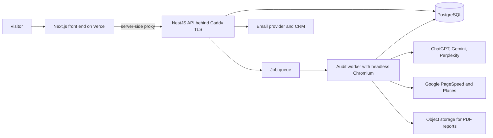

# Rizing Growth OS

## At a glance

| | |
|---|---|
| Industry | Digital marketing agency (AI search and SEO) |
| Type | SaaS lead-generation tool with client and agent portals |
| Stack | Next.js, Tailwind, NestJS, Prisma, PostgreSQL, BullMQ on Valkey, headless Chromium, Docker Compose, Caddy, DigitalOcean, Vercel, GitHub Actions |
| Live | https://audit.rizingmetrics.com |
| Year | 2026 |
| Role | Solo build: product, back end, front end, infrastructure, CI |

## The problem

Rizing Metrics sells AI-visibility and SEO services. They wanted a public tool that turns a curious visitor into a qualified lead: type in a website, get an instant score, leave an email, receive a full report. The audit had to be genuinely useful, not a gimmick, so it needed real data from several AI engines and Google, and it had to run unattended at agency scale without a large hosting bill.

## What I built

- A five-pillar audit engine. Each site is scored on AI visibility (how ChatGPT, Gemini and Perplexity answer when asked for a business like this one), Google presence, page performance, security and on-page SEO and UX.
- A queued worker pipeline. The web API accepts the request and returns a teaser in seconds; a separate worker runs the long crawl and AI calls, so the public site stays fast under load and a slow third party never blocks a user.
- Full PDF reports rendered server-side and stored in object storage, delivered by email through the agency's email provider, with leads pushed into their CRM.
- An admin portal for the agency team, a client portal for report owners, and an internal agent console where each rep sees only their own clients.
- Payments through Stripe for paid tiers, with webhook handling and receipts.
- An API gateway layer so the back end only accepts traffic proxied through the front end, plus per-IP rate limiting and graceful degradation when any single data provider fails.
- Two fully isolated environments, staging and production, each deployed automatically from its own branch by a single branch-aware GitHub Actions workflow.

## Architecture

## Results

- The audit pipeline runs end to end unattended, with all five pillars scoring and any single failed provider degrading to a partial report instead of a failed one.
- The whole production back end, including the queue, worker, database and TLS, runs on one small cloud server for a low fixed monthly cost.
- Deploys are a push to a branch. Staging and production have never needed a manual deploy since the pipeline went in.

## What the client got

- Production and staging environments with automatic deploys on push, health checks and daily snapshots.
- An infrastructure document covering every service, environment variable and recovery step, written for the next developer.
- Admin access to manage settings, email templates, payment configuration and leads without touching code.
- A test suite of several hundred unit and end-to-end tests that runs in CI before every deploy.
