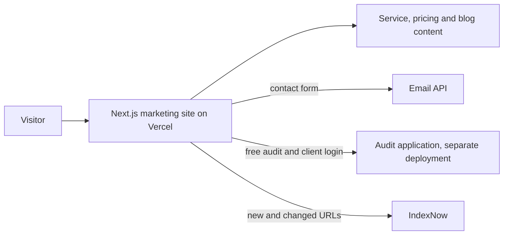

# Rizing Metrics marketing site

## At a glance

| | |
|---|---|
| Industry | Digital marketing agency (AI search and SEO), Maryland, United States |
| Type | Agency marketing site with services, blog and pricing |
| Stack | Next.js 16, React 19, TypeScript, Tailwind, Framer Motion, GSAP, Lenis, transactional email API, structured data, IndexNow, Vercel |
| Live | https://www.rizingmetrics.com |
| Year | 2026 |
| Role | Solo build and ongoing development |

## The problem

Rizing Metrics sells SEO and AI-visibility services, so its own website is the first proof a prospect checks. It has to rank for what the agency sells, explain a fast-moving subject clearly, and move a visitor toward one of two actions: running the free audit or choosing a plan. It also has to be easy to keep publishing to, because the content programme never stops.

## What I built

- A marketing site with a page for each service, a pricing page with monthly and annual plans, a blog, About, Contact and legal pages, in light and dark themes.
- Structured data on every page type: the organisation, each service and FAQs, generated from the same content the page renders.
- A blog built for a steady publishing rhythm, with article covers, internal linking between related guides, and search engines notified of new and changed URLs through IndexNow.
- A cookie consent banner with an essential-only option, a contact form with server-side delivery, and a chat widget.
- Clear paths into the audit product, which is a separate application: the free audit entry point and the client login.
- A repeatable on-page pattern, first proven on the home page and then applied across every service page.

## Architecture

## Results

- The site carries the agency's whole funnel: content brings the visitor in, and the audit tool or a plan is one click away from every page.
- Publishing is routine. New guides and service updates ship through pull requests several times a month without layout work.
- Every optional integration switches off cleanly when it is not configured, so a feature can be paused without a code change or a broken page.

## What the client got

- A codebase the agency's own SEO work happens in directly: titles, schema and copy changes are small, reviewable pull requests.
- A README covering environment variables and what each piece does when a key is missing: features switch off with a clear message and do not fail silently.
- A marketing site and an audit product that deploy independently, so a change to one cannot take down the other.

## Related

- [Rizing Growth OS](rizing-growth-os.md), the audit product this site feeds.
