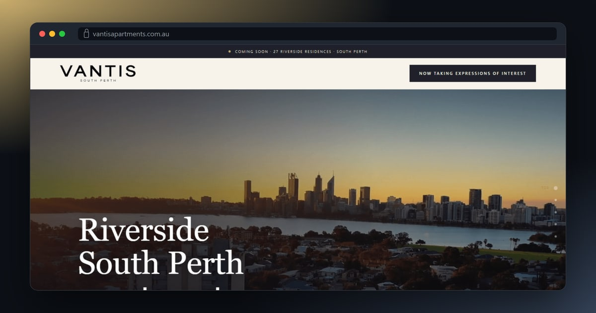
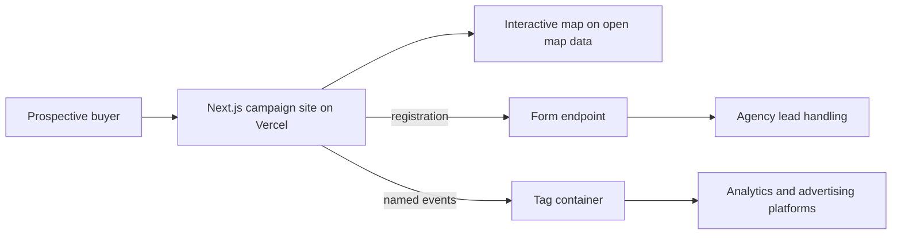

# Vantis Apartments

## At a glance

| | |
|---|---|
| Industry | Residential property development, South Perth, Western Australia |
| Type | Pre-launch campaign site for registering buyer interest |
| Stack | Next.js, React, TypeScript, React Hook Form, Zod, MapLibre with OpenStreetMap data, Google Tag Manager, Vercel |
| Live | https://www.vantisapartments.com.au |
| Year | 2026 |
| Role | Solo build as a freelance developer for Reign Media |

## The problem

Vantis is a boutique apartment development that had not yet released floorplans or pricing. Before a public launch the developer needed a site with one job: present the project well enough that a prospective buyer registers their interest, and tell the marketing team exactly which advertising produced each registration. The brand, the copy and the campaign plan were all still moving, so the site had to absorb several rounds of change without becoming fragile.

## What I built

- A single-page campaign site that takes the visitor through the residences, the lifestyle, the location and the questions buyers ask, and returns them to the registration form at each step.
- A registration form with schema validation that captures what the sales team needs to qualify a lead: bedrooms wanted, purchase position and preferred contact method.
- A custom dark-styled interactive map of the neighbourhood built on open map data, showing the site in relation to the river, the city and nearby landmarks, with no paid map licence.
- A measurement layer that loads one tag container and nothing else. The site emits named events for a completed registration and for each primary call to action, and the marketing team wires advertising pixels to those events without a code change.
- The developer's brand typefaces and vector logos, with a restrained layout that leaves room for the artist impressions.
- Five iterations as the brand and the campaign evolved, with the current build replacing each earlier one cleanly.

## Architecture

## Results

- The developer has a live pre-launch presence that collects qualified registrations ahead of the public release.
- Every registration and every primary button press is a named event, so the marketing team can attribute leads to campaigns and change tags without a developer.
- The site holds one tracking snippet in code. Everything else is managed in the tag container.

## What the client got

- A step-by-step tracking setup guide written for the agency's marketing team, covering the tag container, the advertising pixel and how to test each event.
- A small, dependency-light codebase that is cheap to host and quick to change when floorplans and pricing are released.
- Lead events with consistent names and fields, ready for reporting.
