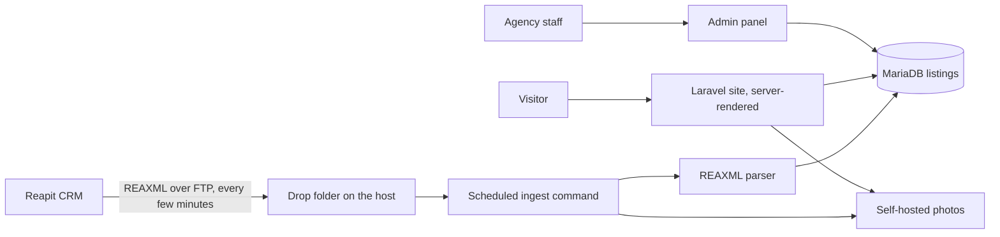

# View Real Estate

## At a glance

| | |
|---|---|
| Industry | Real estate agency, Perth and the Pilbara, Western Australia |
| Type | Agency website with live listings synced from the agency's CRM |
| Stack | Laravel 12, Blade, Alpine.js, Vue islands, Filament admin, MariaDB, shared hosting (cPanel) |
| Live | https://viewre.com.au |
| Year | 2026 |
| Role | Solo build, delivered through an agency |

## The problem

View Real Estate was running an ageing WordPress site that was slow, costly to keep secure, and awkward to update. Their listings live in Reapit, a CRM that has no listings API. Instead it pushes an industry-standard XML feed (REAXML) to an FTP folder every few minutes. The new site had to read that feed reliably, show every sale, lease and commercial listing with correct status, photos and pricing rules, and run on the agency's existing shared hosting with no Node runtime and no containers.

## What I built

- A server-rendered Laravel site with search by suburb, postcode or keyword across buy, lease and commercial channels, listing pages with galleries and maps, team and testimonial pages, and appraisal request forms.
- A REAXML parser tested against the agency's real feed rather than just the published schema. Real-world quirks it handles: vendor-specific extension fields that carry coordinates and region names, dozens of empty image placeholders per listing, invalid zero dates, unit-style street numbers, and hidden prices that must never be displayed or stored.
- An ingest worker that runs on a schedule, picks up new feed files from disk, upserts listings by their CRM identity, downloads and self-hosts every photo (the CRM forbids hotlinking), archives processed files, and withdraws listings the feed removes.
- Distance-based search using plain latitude and longitude, which keeps the whole thing portable across MySQL and MariaDB.
- A hardened admin panel where the agency edits pages, team members and testimonials, with two-factor login, throttling and an audit log. Listings are read-only there because the feed owns them.
- A feed status page in the admin showing the last successful run, so a stalled feed is visible without anyone reading logs.

## Architecture

## Results

- Listings appear on the site within minutes of being updated in the CRM, with no manual entry and no third-party listings plugin.
- Server-rendered HTML means every listing is indexable by Google, Bing and AI crawlers, and link previews work on WhatsApp and Facebook, which a client-side app on this hosting could not have delivered.
- The parser has been exercised against the agency's real feed, so the edge cases that break naive importers are covered by tests rather than discovered in production.

## What the client got

- A site that updates itself from the CRM with no manual listing entry.
- An admin panel the agency uses for everything that is not a listing.
- A deployment guide for their cPanel host, including the scheduled task and how to check the feed is healthy.
- A sanitised sample of their feed kept with the code, so the parser can be regression-tested against real data in future.
