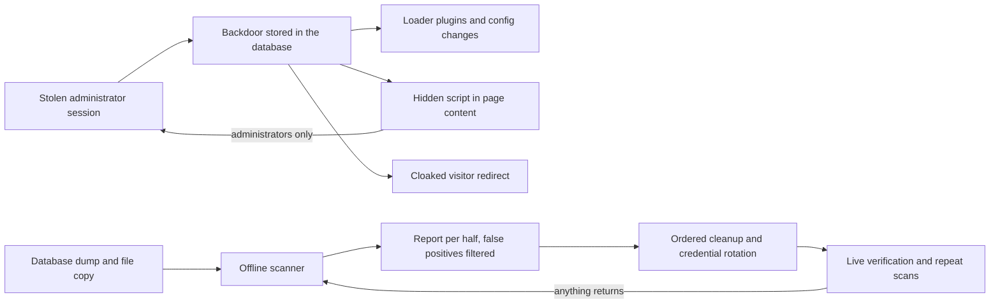

# WordPress malware cleanup across several sites

This study is anonymised. No client, site, domain or indicator value is named, and there is no screenshot.

## At a glance

| | |
|---|---|
| Industry | Several small businesses in different industries |
| Type | Security incident response: investigation, cleanup, hardening and verification |
| Stack | WordPress, PHP, MySQL and MariaDB, shared hosting, WP-CLI, a purpose-built offline scanner |
| Live | Not listed |
| Year | 2026 |
| Role | Solo investigation and remediation |

## The problem

A business owner reported that visitors were being sent to a fake "verify you are human" page. Online scanners and the security plugin already installed on the site all reported it clean. Password resets and two earlier cleanups had not held: the infection came back each time. Over the following weeks the same campaign turned up on several more WordPress sites, which meant the question was no longer how to clean one site but how the attacker kept getting back in.

## What I found

- A redirect layer in the server configuration that sent selected visitors to the fake verification page. On one site it only fired for visitors with a particular browser language, so the owner never saw it.
- A script hidden in page content that ran only for logged-in administrators and quietly sent their session cookie to the attacker. Anonymous visitors and scanners never triggered it, which is why every outside check came back clean.
- The core of the infection: a large self-healing backdoor stored in the database, not in a file. It could run arbitrary code, rewrite the site's configuration, reinstall its own loader plugins if they were deleted, and pause itself when it recognised a security scanner.
- A credential logger that recorded administrator logins in plain text, disguised as an image in the media library. This is why password resets had not worked.
- A small must-use plugin posing as a routine health check, which reloaded the backdoor on every request.
- On a later site, a newer variant that fetched its next stage from a public blockchain, so there was no server to take down.
- The common thread across most of the sites: one administrator login reused on all of them. A session stolen from one site opened the others.

## What I did

- Wrote an offline scanner that reads a database dump and a copy of the site's files and reports on each half separately, because this family lives in both and cleaning one half is not enough.
- Taught the scanner to look for what signature scans miss: scripts gated on administrator sessions, outbound beacons, encoded blobs in settings rows, and code in upload folders.
- Built a list of known false positives, such as a security plugin's own signature files, hosting maintenance drop-ins and plugin update caches, so a report stays readable and a real finding is not buried.
- Removed every component in the right order (the stored backdoor and its loaders first, then the injected content and redirects), then rotated credentials and secret keys, enabled two-factor login and removed compromised accounts. Where an account was the owner's to change, they got the exact list.
- Verified on the live server where access was available: core file checksums, plugin inventory, scheduled tasks, upload folders and server configuration, plus a request made with the cloaked language header.
- Re-scanned every fresh export the owners supplied afterwards to confirm nothing had re-installed itself.

## Architecture

## Results

- Each affected site was returned to a state that scanned clean on both the database and the files, and every follow-up export supplied afterwards stayed clean.
- The reinfection route was identified, which earlier cleanups had missed: stolen administrator sessions and logins, including one login shared across sites. Where the owner confirmed rotation and two-factor login, the infection did not come back.
- In-place cleanup held even on the most heavily compromised site, where a full rebuild had first looked unavoidable. The rebuild stayed available as the fallback and was not needed.
- Sites that had been reported clean by standard tools while still infected were identified, because the scanner looks for behaviour that only shows to a logged-in administrator.

## What the client got

- A written incident report for each site: what was found, what was removed, what was a false alarm, and what remained to do.
- A hardening checklist: unique administrator accounts per site, two-factor login, rotated keys and passwords, backups moved out of the public web folder, and code execution blocked in upload folders.
- A short monitoring routine the owner or their host can run to confirm the infection has not returned.
- Guidance on requesting removal from security vendor blocklists once a site had stayed clean.
